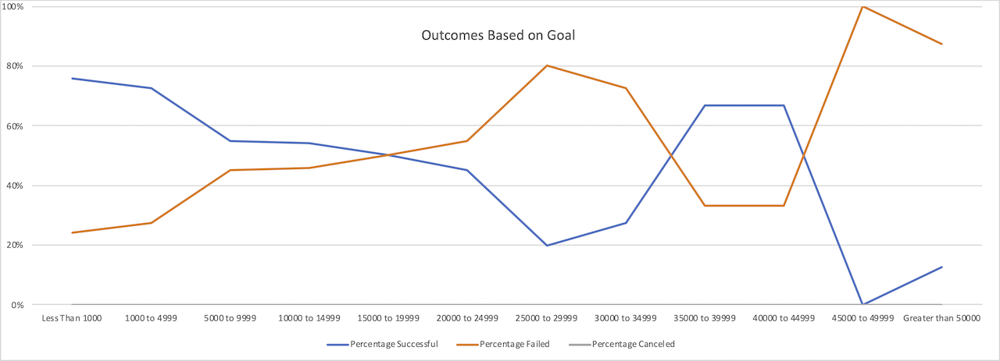

# kickstarter-analysis
Performing analysis on Kickstarter data to uncover trends

#### Outcomes Based on Goal

This analysis looks at the relationship between a project's goal and its ultimate outcome in the category of theatrical plays.

The most successful projects are the ones in the category of less that $1000 with a 76% success. With increasing targets, the likelihood of success steadily decreases to around 20% for projects with goals around $30,000. Interestingly, the data shows an increased chance of success (67%) for projects between $35,000 and $45,000, but that has to be taken with a grain of salt, because there were only a few Kickstarter campaigns in that range.

With goals of $50,000 or more, almost all (88%) projects fail.

Unlike in other categories, there have been no canceled projects among theatrical plays.

#### Outcomes Based on Launch Date

This analysis looks at the success of projects based on the launch date.

May and June have the most successful projects (111 and 100 respectively). We can see a rise in the number of successful kickstarters starting in April with a peak in May and then decline till October. In October, there is another peek of successful projects, but we also have to notice that there is high number if failed ones (65 successful vs. 50 failed), in May it is 111 vs. 52.
We see similar trend in failed kickstarters, most fails in May and October.

Looking at the data, number of canceled kickstarters is very similar during the year, with the highest number in January and for the month of October when we don't have any available data.

